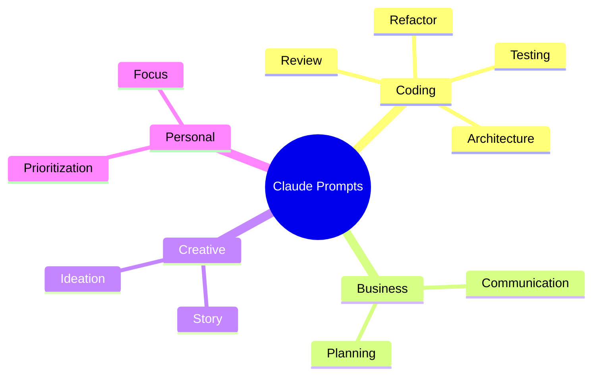
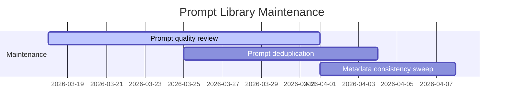

# Claude Prompts Collection

A focused, lightweight repository of production-ready Claude prompts.

## Purpose

This repository is intentionally scoped to one job: store high-quality prompts in a clean, reusable format.

- Keep prompts easy to discover.
- Keep prompt files consistent.
- Avoid non-essential project bloat.

## Repository Layout

```text
claude-prompts/
├── prompts/                 # Active prompt library by category
│   ├── business/
│   ├── coding/
│   ├── creative/
│   └── personal/
├── templates/               # Authoring template for new prompts
├── CATALOG.md               # Prompt index
├── CHANGELOG.md             # Version history
└── README.md
```

## Quick Start

1. Open `prompts/` and choose a category.
2. Copy the prompt you need.
3. Replace variables/placeholders for your context.
4. Use the prompt with Claude.

## Core Features

| Feature | Description | Why It Matters |
|---|---|---|
| Category Organization | Prompts grouped into business/coding/creative/personal | Faster discovery |
| Standard Prompt Format | Prompt files use consistent frontmatter and structure | Easier maintenance and reuse |
| Catalog Index | `CATALOG.md` provides a browsable inventory | Better navigation at scale |
| Prompt Template | `templates/prompt-template.md` for new prompt creation | Consistent contribution quality |

## Use Cases

- Code review and refactoring guidance
- Architecture and API planning
- Testing and debugging workflows
- Personal productivity and task planning
- Creative ideation and drafting

## Prompt Quality Model

### Definition

Prompt quality here means clarity, applicability, and reproducibility.

### Motivation

Teams need prompts that are easy to adapt and produce predictable outcomes.

### Step-by-Step Mechanism

1. Select prompt category.
2. Pick the closest prompt baseline.
3. Customize variables for your context.
4. Run with Claude.
5. Refine and persist improvements.

### Mathematical Formulation

$$
Q = w_c C + w_r R + w_s S
$$

Where:

- $C$ = clarity score
- $R$ = relevance score
- $S$ = structure score
- $w_*$ = weighting coefficients for your team

### Implementation Detail

Quality is enforced mainly through folder conventions, template usage, and review discipline.

### Measured Impact

Track:

- Time to find a usable prompt
- Number of edits needed before first successful output
- Reuse rate per prompt

## Prompt Taxonomy (Mindmap)



## Curation Timeline (Gantt)



## Dependency Notes

This repository is now content-first and intentionally has no required runtime/build dependencies.

| Item | Status | Reason |
|---|---|---|
| Node/TypeScript toolchain | Removed | Not needed for prompt-only repository |
| Python validation/test stack | Removed | Keep repository lightweight |
| VS Code extension source | Removed | Scope narrowed to prompt library |

## Contribution

1. Start with `templates/prompt-template.md`.
2. Add new prompt under the right folder in `prompts/`.
3. Update `CATALOG.md` if needed.
4. Keep prompt naming clear and descriptive.

## FAQ

### Why is this repository minimal now?

To keep focus on prompt quality and reduce maintenance overhead from unrelated tooling.

### Where are active prompts stored?

In `prompts/`.

### Where is the template for new prompts?

In `templates/prompt-template.md`.

## License

MIT License.
