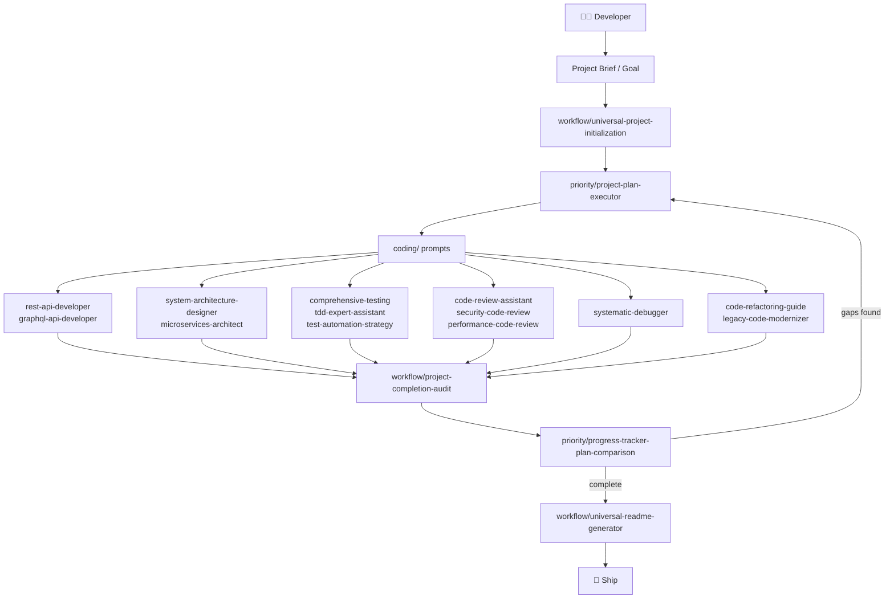
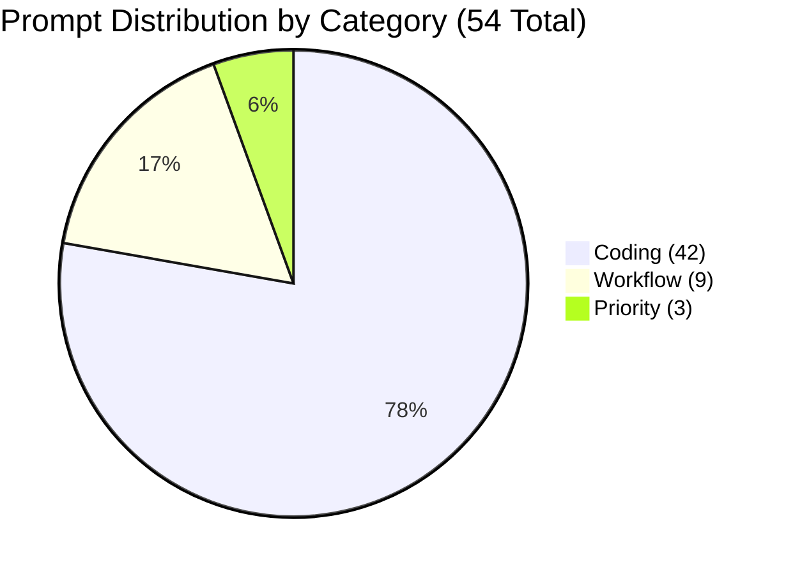
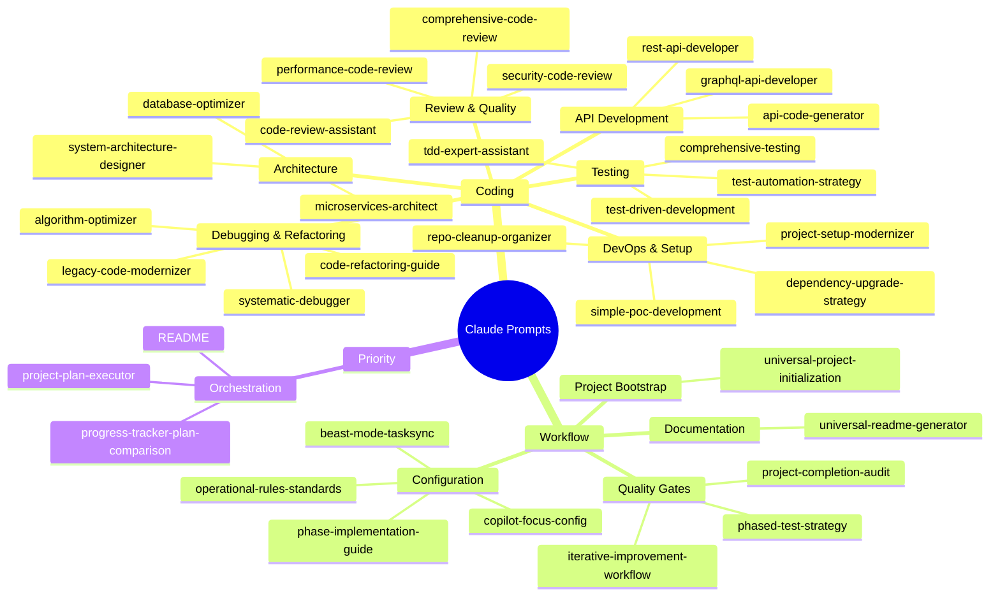
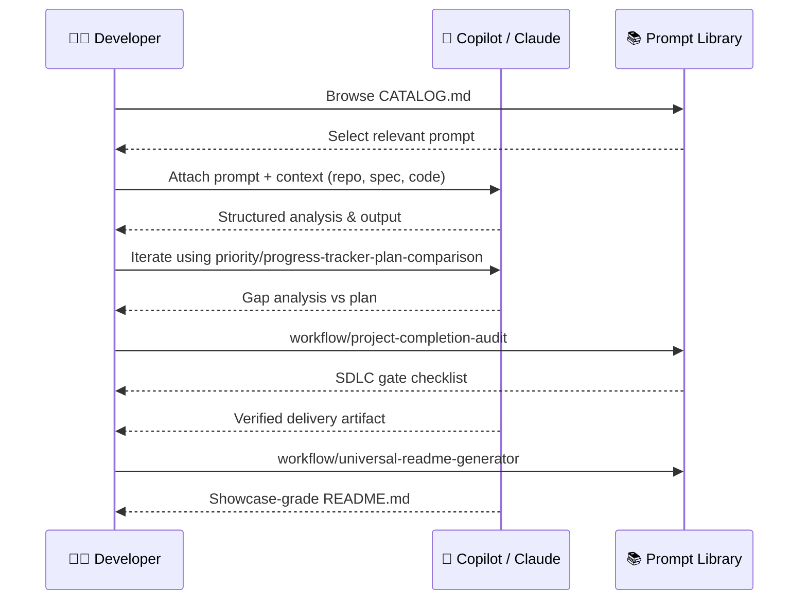
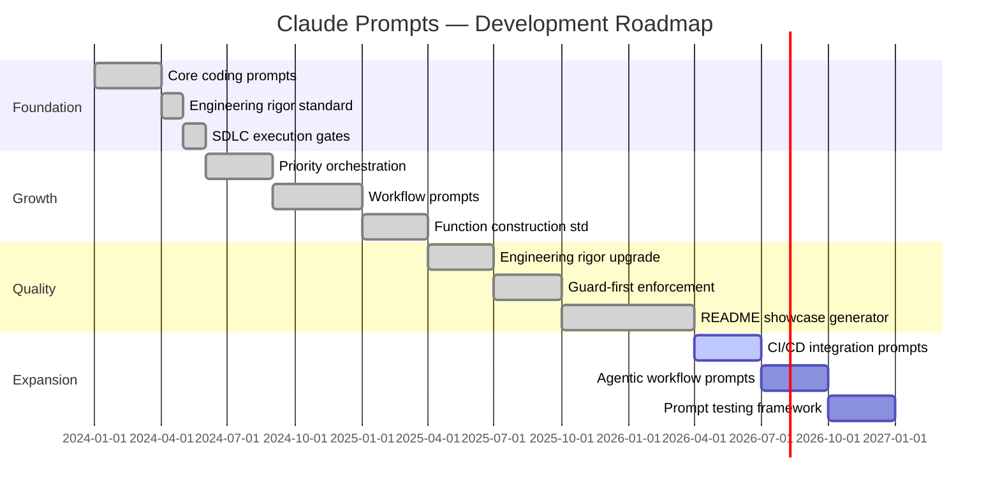

<div align="center" id="top">

# 🧠 Claude Prompts

**Engineering-grade SDLC prompt library for GitHub Copilot and Claude**

_54 battle-tested prompts built to mission-critical engineering standards — covering every phase of the software development lifecycle._

</div>

<div align="center">

[](LICENSE)
[](https://github.com/hkevin01/claude-prompts/stargazers)
[](https://github.com/hkevin01/claude-prompts/network)
[](https://github.com/hkevin01/claude-prompts/commits/main)
[](https://github.com/hkevin01/claude-prompts)
[](CATALOG.md)

</div>

---

## Table of Contents

- [Overview](#overview)
- [Key Features](#key-features)
- [Architecture](#architecture)
- [Prompt Distribution](#prompt-distribution)
- [Prompt Taxonomy](#prompt-taxonomy)
- [SDLC Usage Flow](#sdlc-usage-flow)
- [Technology Stack](#technology-stack)
- [Setup & Installation](#setup--installation)
- [Usage](#usage)
- [Core Capabilities](#core-capabilities)
- [Project Roadmap](#project-roadmap)
- [Development Status](#development-status)
- [Contributing](#contributing)
- [License](#license)

---

## Overview

**Claude Prompts** is a curated library of 54 structured prompts for GitHub Copilot and Anthropic Claude, engineered to enforce deterministic, high-quality output at every stage of the SDLC. Each prompt encodes a repeatable engineering workflow with:

- **Guard-first function construction** — preconditions validated before logic runs
- **SDLC execution gates** — checkpoints that block invalid phase transitions
- **Mission-critical rigor standards** — requirements traceability, verification evidence, failure mode analysis
- **Security-by-default** — least privilege, no hardcoded secrets, dependency vetting built in

> [!IMPORTANT]
> This library is **software and SDLC focused only**. Every prompt targets a specific engineering or delivery workflow: coding, architecture, review, testing, debugging, planning, and documentation.

> [!TIP]
> Start with `prompts/priority/project-plan-executor.md` for orchestrated multi-phase delivery, or `prompts/workflow/universal-project-initialization.md` to bootstrap a new project from zero.

<p align="right">(<a href="#top">back to top ↑</a>)</p>

---

## Key Features

| <sub>Icon</sub> | <sub>Feature</sub> | <sub>Description</sub> | <sub>Impact</sub> | <sub>Status</sub> |
|------|---------|-------------|--------|--------|
| <sub>🔒</sub> | <sub>Guard-First Engineering</sub> | <sub>Every prompt enforces input validation before logic proceeds</sub> | <sub>Eliminates silent failures</sub> | <sub>✅ Stable</sub> |
| <sub>🎯</sub> | <sub>SDLC Gate Enforcement</sub> | <sub>7-gate delivery checklist in every prompt</sub> | <sub>Catches scope/quality gaps at handoff</sub> | <sub>✅ Stable</sub> |
| <sub>🧬</sub> | <sub>Engineering Rigor Standards</sub> | <sub>Requirements traceability, V&V, failure modes in all prompts</sub> | <sub>Raises output quality measurably</sub> | <sub>✅ Stable</sub> |
| <sub>🗂️</sub> | <sub>54-Prompt Library</sub> | <sub>Covers API dev, testing, refactoring, debugging, architecture, CI/CD</sub> | <sub>Full SDLC coverage</sub> | <sub>✅ Stable</sub> |
| <sub>🔄</sub> | <sub>Execution Orchestration</sub> | <sub>Priority prompts chain planning → execution → audit loops</sub> | <sub>Closes feedback gap in AI-assisted dev</sub> | <sub>✅ Stable</sub> |
| <sub>📊</sub> | <sub>README Automation</sub> | <sub>Universal README generator produces showcase-quality docs</sub> | <sub>Documentation bottleneck removed</sub> | <sub>✅ Stable</sub> |
| <sub>🧪</sub> | <sub>Test Strategy Coverage</sub> | <sub>TDD, BDD, unit, integration, E2E, performance prompts</sub> | <sub>Every test type explicitly covered</sub> | <sub>✅ Stable</sub> |
| <sub>🛡️</sub> | <sub>Security Code Review</sub> | <sub>OWASP Top 10, supply chain, secrets scanning baked in</sub> | <sub>Security left-shifted to design phase</sub> | <sub>✅ Stable</sub> |

<p align="right">(<a href="#top">back to top ↑</a>)</p>

---

## Architecture

How the prompt library is organized and how the categories interact with the SDLC:



**Component Responsibilities:**

| <sub>Layer</sub> | <sub>Category</sub> | <sub>Purpose</sub> |
|-------|----------|---------|
| <sub>Orchestration</sub> | <sub>`priority/`</sub> | <sub>Multi-phase planning, execution tracking, gap analysis</sub> |
| <sub>Workflow</sub> | <sub>`workflow/`</sub> | <sub>Cross-cutting SDLC automation: init, audit, README, config</sub> |
| <sub>Implementation</sub> | <sub>`coding/`</sub> | <sub>Specific engineering tasks: API, test, review, debug, refactor</sub> |

<p align="right">(<a href="#top">back to top ↑</a>)</p>

---

## Prompt Distribution



| <sub>Category</sub> | <sub>Count</sub> | <sub>Percentage</sub> | <sub>Description</sub> |
|----------|-------|------------|-------------|
| <sub>`coding/`</sub> | <sub>42</sub> | <sub>77.8%</sub> | <sub>Specific engineering workflow prompts</sub> |
| <sub>`workflow/`</sub> | <sub>9</sub> | <sub>16.7%</sub> | <sub>SDLC meta-workflow and automation prompts</sub> |
| <sub>`priority/`</sub> | <sub>3</sub> | <sub>5.5%</sub> | <sub>High-level orchestration and tracking prompts</sub> |
| <sub>**Total**</sub> | <sub>**54**</sub> | <sub>**100%**</sub> | <sub>All categories</sub> |

<p align="right">(<a href="#top">back to top ↑</a>)</p>

---

## Prompt Taxonomy



<p align="right">(<a href="#top">back to top ↑</a>)</p>

---

## SDLC Usage Flow

How a developer interacts with the library across a full delivery cycle:



<p align="right">(<a href="#top">back to top ↑</a>)</p>

---

## Technology Stack

| <sub>Technology</sub> | <sub>Purpose</sub> | <sub>Why Chosen</sub> | <sub>Alternatives Considered</sub> |
|------------|---------|------------|------------------------|
| <sub>**Markdown**</sub> | <sub>Prompt format</sub> | <sub>Universally renderable; native GitHub support</sub> | <sub>YAML-only configs (less human-readable)</sub> |
| <sub>**Python 3**</sub> | <sub>Validation & catalog scripts</sub> | <sub>Fast scripting; rich stdlib; CI-friendly</sub> | <sub>Bash-only (fragile for complex logic)</sub> |
| <sub>**Node.js / Prettier**</sub> | <sub>Markdown formatting</sub> | <sub>Industry-standard formatter; configurable</sub> | <sub>`mdformat` (less ecosystem support)</sub> |
| <sub>**markdownlint**</sub> | <sub>Markdown lint</sub> | <sub>Enforces consistent style rules</sub> | <sub>Manual review (unreliable at scale)</sub> |
| <sub>**YAML Frontmatter**</sub> | <sub>Prompt metadata</sub> | <sub>Machine-parseable; human-readable</sub> | <sub>JSON header (verbose)</sub> |
| <sub>**Mermaid**</sub> | <sub>Diagrams in prompts/docs</sub> | <sub>Native GitHub rendering; no external images</sub> | <sub>PlantUML (requires server render)</sub> |

<p align="right">(<a href="#top">back to top ↑</a>)</p>

---

## Setup & Installation

### Prerequisites

- Git
- Python 3.8+
- Node.js 18+ (for markdown formatting/linting)

### Clone & Install

```bash
# Clone the repository
git clone https://github.com/hkevin01/claude-prompts.git
cd claude-prompts

# Install Node.js tooling (formatting and lint)
npm install

# Verify Python scripts are functional
python scripts/validate_prompts.py
```

### Validate the Library

```bash
# Run full prompt validation
python scripts/validate_prompts.py

# Regenerate the catalog
python scripts/generate_catalog.py

# Lint all Markdown
npx markdownlint "**/*.md"
```

> [!NOTE]
> No API keys or environment variables are required. This library is pure text — no runtime services needed.

<p align="right">(<a href="#top">back to top ↑</a>)</p>

---

## Usage

### Browse by Category

```bash
# View full prompt catalog
cat CATALOG.md

# List all coding prompts
ls prompts/coding/

# List orchestration prompts
ls prompts/priority/
```

### Use a Prompt with Copilot / Claude

1. Open your target repository in VS Code
2. Select the relevant prompt from `prompts/`
3. Attach the prompt content + your code/context to the AI chat
4. Use `prompts/priority/project-plan-executor.md` to orchestrate multi-step tasks
5. Use `prompts/priority/progress-tracker-plan-comparison.md` to verify progress against plan

### Create a New Prompt

```bash
python scripts/create_prompt.py
```

The script scaffolds a new prompt with the standard frontmatter, Engineering Rigor Standard, Function Construction Standard, and SDLC gate checklist automatically applied.

<details>
<summary>📋 Full Prompt Category Listing</summary>

**Coding Prompts (42)**

| <sub>Prompt</sub> | <sub>Domain</sub> |
|--------|--------|
| <sub>`algorithm-optimizer.md`</sub> | <sub>Performance</sub> |
| <sub>`api-code-generator.md`</sub> | <sub>APIs</sub> |
| <sub>`code-refactoring-guide.md`</sub> | <sub>Refactoring</sub> |
| <sub>`code-review-assistant.md`</sub> | <sub>Review</sub> |
| <sub>`comprehensive-code-review.md`</sub> | <sub>Review</sub> |
| <sub>`comprehensive-testing.md`</sub> | <sub>Testing</sub> |
| <sub>`database-optimizer.md`</sub> | <sub>Data</sub> |
| <sub>`dependency-upgrade-strategy.md`</sub> | <sub>DevOps</sub> |
| <sub>`graphql-api-developer.md`</sub> | <sub>APIs</sub> |
| <sub>`legacy-code-modernizer.md`</sub> | <sub>Refactoring</sub> |
| <sub>`microservices-architect.md`</sub> | <sub>Architecture</sub> |
| <sub>`performance-code-review.md`</sub> | <sub>Review</sub> |
| <sub>`project-setup-modernizer.md`</sub> | <sub>DevOps</sub> |
| <sub>`repo-cleanup-organizer.md`</sub> | <sub>DevOps</sub> |
| <sub>`rest-api-developer.md`</sub> | <sub>APIs</sub> |
| <sub>`security-code-review.md`</sub> | <sub>Security</sub> |
| <sub>`simple-poc-development.md`</sub> | <sub>Prototyping</sub> |
| <sub>`spec-to-code-generator.md`</sub> | <sub>Generation</sub> |
| <sub>`system-architecture-designer.md`</sub> | <sub>Architecture</sub> |
| <sub>`systematic-debugger.md`</sub> | <sub>Debugging</sub> |
| <sub>`tdd-expert-assistant.md`</sub> | <sub>Testing</sub> |
| <sub>`test-automation-strategy.md`</sub> | <sub>Testing</sub> |
| <sub>`test-driven-development.md`</sub> | <sub>Testing</sub> |
| <sub>_(+ 19 variant prompts)_</sub> | <sub>Various</sub> |

**Workflow Prompts (9)**

| <sub>Prompt</sub> | <sub>Purpose</sub> |
|--------|---------|
| <sub>`beast-mode-tasksync.md`</sub> | <sub>Aggressive task sync & unblocking</sub> |
| <sub>`copilot-focus-config.md`</sub> | <sub>Copilot agent customization</sub> |
| <sub>`iterative-improvement-workflow.md`</sub> | <sub>Continuous improvement cycles</sub> |
| <sub>`operational-rules-standards.md`</sub> | <sub>Engineering standards enforcement</sub> |
| <sub>`phase-implementation-guide.md`</sub> | <sub>Phase-by-phase implementation</sub> |
| <sub>`phased-test-strategy.md`</sub> | <sub>Test strategy per SDLC phase</sub> |
| <sub>`project-completion-audit.md`</sub> | <sub>Final delivery gate audit</sub> |
| <sub>`universal-project-initialization.md`</sub> | <sub>Project bootstrap blueprint</sub> |
| <sub>`universal-readme-generator.md`</sub> | <sub>Showcase README generation</sub> |

**Priority Prompts (3)**

| <sub>Prompt</sub> | <sub>Purpose</sub> |
|--------|---------|
| <sub>`project-plan-executor.md`</sub> | <sub>Multi-phase plan orchestration</sub> |
| <sub>`progress-tracker-plan-comparison.md`</sub> | <sub>Plan vs. actual gap analysis</sub> |
| <sub>`README.md`</sub> | <sub>Priority category guide</sub> |

</details>

<p align="right">(<a href="#top">back to top ↑</a>)</p>

---

## Core Capabilities

### 🔒 Engineering Rigor in Every Prompt

Every prompt in the library includes an **Engineering Rigor Standard** section with:

- **Requirements Quality** — acceptance criteria, traceability, assumption capture
- **Design Quality** — ADR documentation, interface contracts, risk identification
- **Implementation Quality** — determinism, boundary validation, structured errors
- **Function Construction Standard** — guards → setup → loop → returns → errors
- **Verification & Validation** — test coverage evidence, non-functional requirements
- **Security & Compliance** — least privilege, no secrets, supply chain checks
- **SDLC Execution Gates** — 7 mandatory delivery checkpoints

### 🎯 Priority Orchestration Loop

```
project-plan-executor  →  [coding prompts]  →  project-completion-audit
        ↑                                               |
        └──────── progress-tracker-plan-comparison ←───┘
                         (gap analysis)
```

The three priority prompts form a closed feedback loop: plan → execute → audit → compare → re-plan.

> [!WARNING]
> Do not skip the `project-completion-audit.md` step. It catches scope drift, missing tests, and undocumented changes that accumulate silently during AI-assisted development.

### 🧪 Test Coverage Matrix

| <sub>Test Type</sub> | <sub>Prompt</sub> | <sub>Gate</sub> |
|-----------|--------|------|
| <sub>Unit tests</sub> | <sub>`tdd-expert-assistant`</sub> | <sub>Test gate</sub> |
| <sub>Integration</sub> | <sub>`comprehensive-testing`</sub> | <sub>Test gate</sub> |
| <sub>Performance</sub> | <sub>`performance-code-review`</sub> | <sub>Quality gate</sub> |
| <sub>Security</sub> | <sub>`security-code-review`</sub> | <sub>Security gate</sub> |
| <sub>Strategy</sub> | <sub>`test-automation-strategy`</sub> | <sub>Scope gate</sub> |
| <sub>Phased</sub> | <sub>`phased-test-strategy`</sub> | <sub>Build gate</sub> |

<p align="right">(<a href="#top">back to top ↑</a>)</p>

---

## Project Roadmap



| <sub>Phase</sub> | <sub>Goals</sub> | <sub>Target</sub> | <sub>Status</sub> |
|-------|-------|--------|--------|
| <sub>Foundation</sub> | <sub>Core coding prompts, SDLC gates</sub> | <sub>Q1–Q2 2024</sub> | <sub>✅ Complete</sub> |
| <sub>Growth</sub> | <sub>Priority orchestration, workflow prompts</sub> | <sub>2024–2025</sub> | <sub>✅ Complete</sub> |
| <sub>Quality</sub> | <sub>Engineering rigor, guard-first functions, README gen</sub> | <sub>2025–2026</sub> | <sub>✅ Complete</sub> |
| <sub>Expansion</sub> | <sub>CI/CD prompts, agentic workflows, test framework</sub> | <sub>2026–2027</sub> | <sub>🟡 In Progress</sub> |

<p align="right">(<a href="#top">back to top ↑</a>)</p>

---

## Development Status

| <sub>Metric</sub> | <sub>Value</sub> |
|--------|-------|
| <sub>Version</sub> | <sub>2.0</sub> |
| <sub>Total Prompts</sub> | <sub>54</sub> |
| <sub>Stability</sub> | <sub>Stable</sub> |
| <sub>Coding Prompts</sub> | <sub>42</sub> |
| <sub>Workflow Prompts</sub> | <sub>9</sub> |
| <sub>Priority Prompts</sub> | <sub>3</sub> |
| <sub>Engineering Rigor Sections</sub> | <sub>54/54 (100%)</sub> |
| <sub>Function Construction Standard</sub> | <sub>54/54 (100%)</sub> |
| <sub>SDLC Gate Checklists</sub> | <sub>54/54 (100%)</sub> |
| <sub>Known Limitations</sub> | <sub>Prompts require human judgment for context tuning</sub> |

> [!NOTE]
> The library contains no runtime code that executes. All prompts are static Markdown files. Validation scripts in `scripts/` verify frontmatter structure and catalog accuracy.

<p align="right">(<a href="#top">back to top ↑</a>)</p>

---

## Contributing

Contributions are welcome. This library follows a strict quality bar — new prompts must meet the same Engineering Rigor Standard as existing ones.

### Workflow

```bash
# 1. Fork the repo and create a branch
git checkout -b feat/your-prompt-name

# 2. Create your prompt (scaffolded with standards)
python scripts/create_prompt.py

# 3. Validate it
python scripts/validate_prompts.py

# 4. Submit a PR
```

<details>
<summary>📋 PR Requirements Checklist</summary>

Before submitting a pull request, verify:

- [ ] Prompt has valid YAML frontmatter (title, category, tags, difficulty, description, author, date, version)
- [ ] Prompt includes the full **Engineering Rigor Standard** section
- [ ] Prompt includes the **Function Construction Standard** subsection
- [ ] Prompt includes the **SDLC Execution Gates** with 7 checkboxes
- [ ] `python scripts/validate_prompts.py` passes with no errors
- [ ] CATALOG.md is updated (`python scripts/generate_catalog.py`)
- [ ] Prompt is software/SDLC focused (no business, personal, or creative content)
- [ ] No duplicate coverage of an existing prompt (check CATALOG.md first)
- [ ] Prompt tested with at least one AI model (Copilot or Claude) and output reviewed

</details>

> [!CAUTION]
> Do not add prompts for non-SDLC topics (business writing, personal productivity, creative writing). This library is purpose-built for software engineering workflows only.

<p align="right">(<a href="#top">back to top ↑</a>)</p>

---

## License

This project is licensed under the **MIT License** — you are free to use, modify, and distribute these prompts in personal and commercial projects. Attribution appreciated but not required.

See [LICENSE](LICENSE) for the full text.

---

<div align="center">

**Built for engineers who refuse to ship substandard work.**

[](https://github.com/hkevin01/claude-prompts/stargazers)
[](https://github.com/hkevin01/claude-prompts/network)

[⬆ Back to top](#top)

</div>