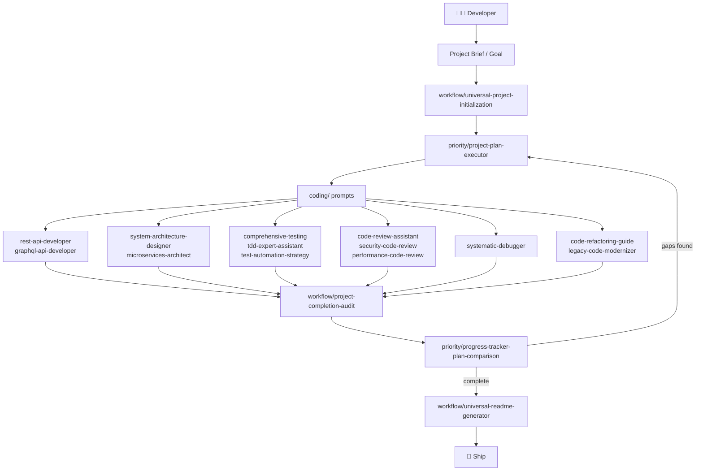
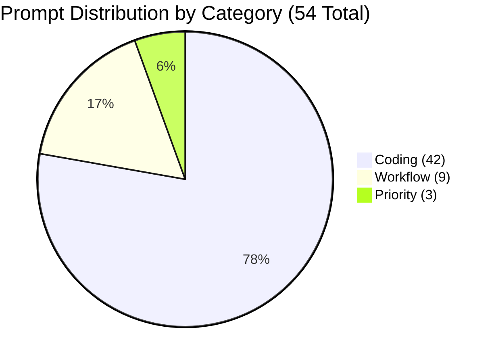
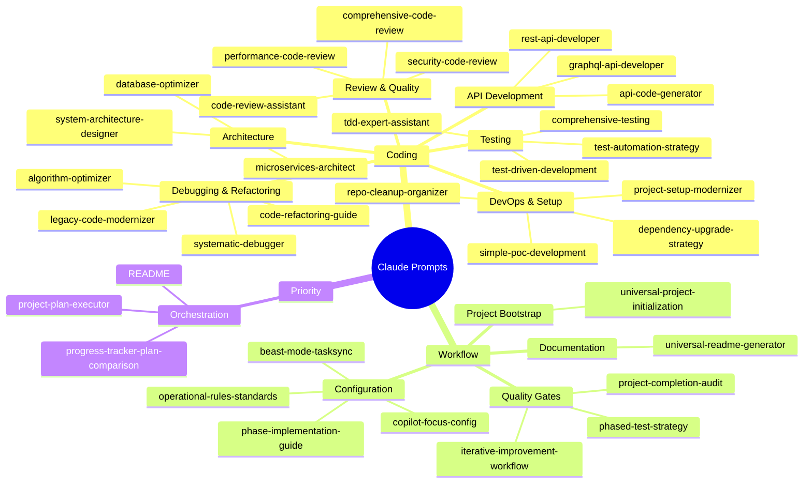
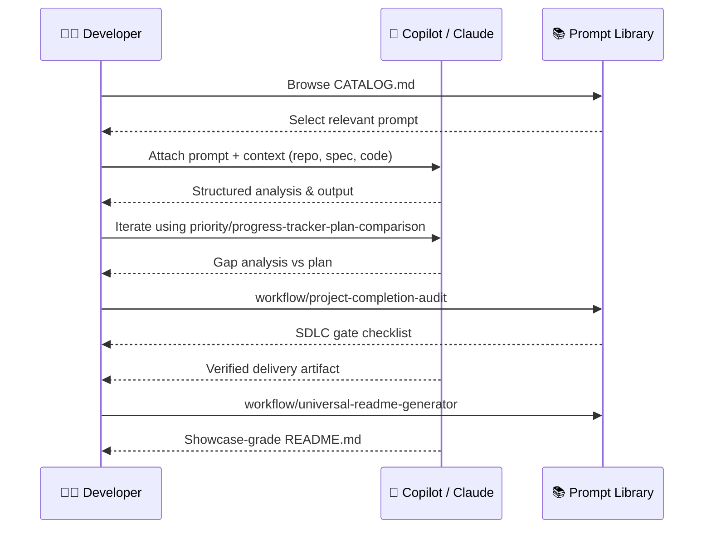
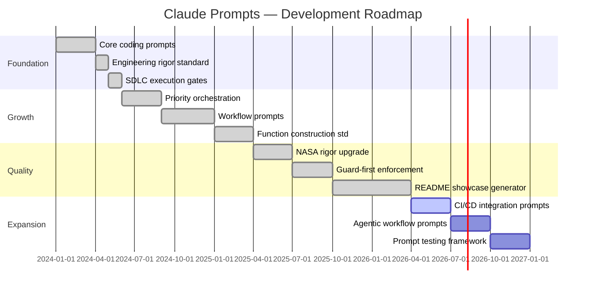

<div align="center" id="top">

# 🧠 Claude Prompts

**Engineering-grade SDLC prompt library for GitHub Copilot and Claude**

_54 battle-tested prompts built to NASA-level rigor standards — covering every phase of the software development lifecycle._

</div>

<div align="center">

[](LICENSE)
[](https://github.com/hkevin01/claude-prompts/stargazers)
[](https://github.com/hkevin01/claude-prompts/network)
[](https://github.com/hkevin01/claude-prompts/commits/main)
[](https://github.com/hkevin01/claude-prompts)
[](CATALOG.md)

</div>

---

## Table of Contents

- [Overview](#overview)
- [Key Features](#key-features)
- [Architecture](#architecture)
- [Prompt Distribution](#prompt-distribution)
- [Prompt Taxonomy](#prompt-taxonomy)
- [SDLC Usage Flow](#sdlc-usage-flow)
- [Technology Stack](#technology-stack)
- [Setup & Installation](#setup--installation)
- [Usage](#usage)
- [Core Capabilities](#core-capabilities)
- [Project Roadmap](#project-roadmap)
- [Development Status](#development-status)
- [Contributing](#contributing)
- [License](#license)

---

## Overview

**Claude Prompts** is a curated library of 54 structured prompts for GitHub Copilot and Anthropic Claude, engineered to enforce deterministic, high-quality output at every stage of the SDLC. Each prompt encodes a repeatable engineering workflow with:

- **Guard-first function construction** — preconditions validated before logic runs
- **SDLC execution gates** — checkpoints that block invalid phase transitions
- **NASA-grade rigor standards** — requirements traceability, verification evidence, failure mode analysis
- **Security-by-default** — least privilege, no hardcoded secrets, dependency vetting built in

> [!IMPORTANT]
> This library is **software and SDLC focused only**. Every prompt targets a specific engineering or delivery workflow: coding, architecture, review, testing, debugging, planning, and documentation.

> [!TIP]
> Start with `prompts/priority/project-plan-executor.md` for orchestrated multi-phase delivery, or `prompts/workflow/universal-project-initialization.md` to bootstrap a new project from zero.

<p align="right">(<a href="#top">back to top ↑</a>)</p>

---

## Key Features

| Icon | Feature | Description | Impact | Status |
|------|---------|-------------|--------|--------|
| 🔒 | Guard-First Engineering | Every prompt enforces input validation before logic proceeds | Eliminates silent failures | ✅ Stable |
| 🎯 | SDLC Gate Enforcement | 7-gate delivery checklist in every prompt | Catches scope/quality gaps at handoff | ✅ Stable |
| 🧬 | NASA Rigor Standards | Requirements traceability, V&V, failure modes in all prompts | Raises output quality measurably | ✅ Stable |
| 🗂️ | 54-Prompt Library | Covers API dev, testing, refactoring, debugging, architecture, CI/CD | Full SDLC coverage | ✅ Stable |
| 🔄 | Execution Orchestration | Priority prompts chain planning → execution → audit loops | Closes feedback gap in AI-assisted dev | ✅ Stable |
| 📊 | README Automation | Universal README generator produces showcase-quality docs | Documentation bottleneck removed | ✅ Stable |
| 🧪 | Test Strategy Coverage | TDD, BDD, unit, integration, E2E, performance prompts | Every test type explicitly covered | ✅ Stable |
| 🛡️ | Security Code Review | OWASP Top 10, supply chain, secrets scanning baked in | Security left-shifted to design phase | ✅ Stable |

<p align="right">(<a href="#top">back to top ↑</a>)</p>

---

## Architecture

How the prompt library is organized and how the categories interact with the SDLC:



**Component Responsibilities:**

| Layer | Category | Purpose |
|-------|----------|---------|
| Orchestration | `priority/` | Multi-phase planning, execution tracking, gap analysis |
| Workflow | `workflow/` | Cross-cutting SDLC automation: init, audit, README, config |
| Implementation | `coding/` | Specific engineering tasks: API, test, review, debug, refactor |

<p align="right">(<a href="#top">back to top ↑</a>)</p>

---

## Prompt Distribution



| Category | Count | Percentage | Description |
|----------|-------|------------|-------------|
| `coding/` | 42 | 77.8% | Specific engineering workflow prompts |
| `workflow/` | 9 | 16.7% | SDLC meta-workflow and automation prompts |
| `priority/` | 3 | 5.5% | High-level orchestration and tracking prompts |
| **Total** | **54** | **100%** | All categories |

<p align="right">(<a href="#top">back to top ↑</a>)</p>

---

## Prompt Taxonomy



<p align="right">(<a href="#top">back to top ↑</a>)</p>

---

## SDLC Usage Flow

How a developer interacts with the library across a full delivery cycle:



<p align="right">(<a href="#top">back to top ↑</a>)</p>

---

## Technology Stack

| Technology | Purpose | Why Chosen | Alternatives Considered |
|------------|---------|------------|------------------------|
| **Markdown** | Prompt format | Universally renderable; native GitHub support | YAML-only configs (less human-readable) |
| **Python 3** | Validation & catalog scripts | Fast scripting; rich stdlib; CI-friendly | Bash-only (fragile for complex logic) |
| **Node.js / Prettier** | Markdown formatting | Industry-standard formatter; configurable | `mdformat` (less ecosystem support) |
| **markdownlint** | Markdown lint | Enforces consistent style rules | Manual review (unreliable at scale) |
| **YAML Frontmatter** | Prompt metadata | Machine-parseable; human-readable | JSON header (verbose) |
| **Mermaid** | Diagrams in prompts/docs | Native GitHub rendering; no external images | PlantUML (requires server render) |

<p align="right">(<a href="#top">back to top ↑</a>)</p>

---

## Setup & Installation

### Prerequisites

- Git
- Python 3.8+
- Node.js 18+ (for markdown formatting/linting)

### Clone & Install

```bash
# Clone the repository
git clone https://github.com/hkevin01/claude-prompts.git
cd claude-prompts

# Install Node.js tooling (formatting and lint)
npm install

# Verify Python scripts are functional
python scripts/validate_prompts.py
```

### Validate the Library

```bash
# Run full prompt validation
python scripts/validate_prompts.py

# Regenerate the catalog
python scripts/generate_catalog.py

# Lint all Markdown
npx markdownlint "**/*.md"
```

> [!NOTE]
> No API keys or environment variables are required. This library is pure text — no runtime services needed.

<p align="right">(<a href="#top">back to top ↑</a>)</p>

---

## Usage

### Browse by Category

```bash
# View full prompt catalog
cat CATALOG.md

# List all coding prompts
ls prompts/coding/

# List orchestration prompts
ls prompts/priority/
```

### Use a Prompt with Copilot / Claude

1. Open your target repository in VS Code
2. Select the relevant prompt from `prompts/`
3. Attach the prompt content + your code/context to the AI chat
4. Use `prompts/priority/project-plan-executor.md` to orchestrate multi-step tasks
5. Use `prompts/priority/progress-tracker-plan-comparison.md` to verify progress against plan

### Create a New Prompt

```bash
python scripts/create_prompt.py
```

The script scaffolds a new prompt with the standard frontmatter, Engineering Rigor Standard, Function Construction Standard, and SDLC gate checklist automatically applied.

<details>
<summary>📋 Full Prompt Category Listing</summary>

**Coding Prompts (42)**

| Prompt | Domain |
|--------|--------|
| `algorithm-optimizer.md` | Performance |
| `api-code-generator.md` | APIs |
| `code-refactoring-guide.md` | Refactoring |
| `code-review-assistant.md` | Review |
| `comprehensive-code-review.md` | Review |
| `comprehensive-testing.md` | Testing |
| `database-optimizer.md` | Data |
| `dependency-upgrade-strategy.md` | DevOps |
| `graphql-api-developer.md` | APIs |
| `legacy-code-modernizer.md` | Refactoring |
| `microservices-architect.md` | Architecture |
| `performance-code-review.md` | Review |
| `project-setup-modernizer.md` | DevOps |
| `repo-cleanup-organizer.md` | DevOps |
| `rest-api-developer.md` | APIs |
| `security-code-review.md` | Security |
| `simple-poc-development.md` | Prototyping |
| `spec-to-code-generator.md` | Generation |
| `system-architecture-designer.md` | Architecture |
| `systematic-debugger.md` | Debugging |
| `tdd-expert-assistant.md` | Testing |
| `test-automation-strategy.md` | Testing |
| `test-driven-development.md` | Testing |
| _(+ 19 variant prompts)_ | Various |

**Workflow Prompts (9)**

| Prompt | Purpose |
|--------|---------|
| `beast-mode-tasksync.md` | Aggressive task sync & unblocking |
| `copilot-focus-config.md` | Copilot agent customization |
| `iterative-improvement-workflow.md` | Continuous improvement cycles |
| `operational-rules-standards.md` | Engineering standards enforcement |
| `phase-implementation-guide.md` | Phase-by-phase implementation |
| `phased-test-strategy.md` | Test strategy per SDLC phase |
| `project-completion-audit.md` | Final delivery gate audit |
| `universal-project-initialization.md` | Project bootstrap blueprint |
| `universal-readme-generator.md` | Showcase README generation |

**Priority Prompts (3)**

| Prompt | Purpose |
|--------|---------|
| `project-plan-executor.md` | Multi-phase plan orchestration |
| `progress-tracker-plan-comparison.md` | Plan vs. actual gap analysis |
| `README.md` | Priority category guide |

</details>

<p align="right">(<a href="#top">back to top ↑</a>)</p>

---

## Core Capabilities

### 🔒 Engineering Rigor in Every Prompt

Every prompt in the library includes an **Engineering Rigor Standard** section with:

- **Requirements Quality** — acceptance criteria, traceability, assumption capture
- **Design Quality** — ADR documentation, interface contracts, risk identification
- **Implementation Quality** — determinism, boundary validation, structured errors
- **Function Construction Standard** — guards → setup → loop → returns → errors
- **Verification & Validation** — test coverage evidence, non-functional requirements
- **Security & Compliance** — least privilege, no secrets, supply chain checks
- **SDLC Execution Gates** — 7 mandatory delivery checkpoints

### 🎯 Priority Orchestration Loop

```
project-plan-executor  →  [coding prompts]  →  project-completion-audit
        ↑                                               |
        └──────── progress-tracker-plan-comparison ←───┘
                         (gap analysis)
```

The three priority prompts form a closed feedback loop: plan → execute → audit → compare → re-plan.

> [!WARNING]
> Do not skip the `project-completion-audit.md` step. It catches scope drift, missing tests, and undocumented changes that accumulate silently during AI-assisted development.

### 🧪 Test Coverage Matrix

| Test Type | Prompt | Gate |
|-----------|--------|------|
| Unit tests | `tdd-expert-assistant` | Test gate |
| Integration | `comprehensive-testing` | Test gate |
| Performance | `performance-code-review` | Quality gate |
| Security | `security-code-review` | Security gate |
| Strategy | `test-automation-strategy` | Scope gate |
| Phased | `phased-test-strategy` | Build gate |

<p align="right">(<a href="#top">back to top ↑</a>)</p>

---

## Project Roadmap



| Phase | Goals | Target | Status |
|-------|-------|--------|--------|
| Foundation | Core coding prompts, SDLC gates | Q1–Q2 2024 | ✅ Complete |
| Growth | Priority orchestration, workflow prompts | 2024–2025 | ✅ Complete |
| Quality | NASA rigor, guard-first functions, README gen | 2025–2026 | ✅ Complete |
| Expansion | CI/CD prompts, agentic workflows, test framework | 2026–2027 | 🟡 In Progress |

<p align="right">(<a href="#top">back to top ↑</a>)</p>

---

## Development Status

| Metric | Value |
|--------|-------|
| Version | 2.0 |
| Total Prompts | 54 |
| Stability | Stable |
| Coding Prompts | 42 |
| Workflow Prompts | 9 |
| Priority Prompts | 3 |
| Engineering Rigor Sections | 54/54 (100%) |
| Function Construction Standard | 54/54 (100%) |
| SDLC Gate Checklists | 54/54 (100%) |
| Known Limitations | Prompts require human judgment for context tuning |

> [!NOTE]
> The library contains no runtime code that executes. All prompts are static Markdown files. Validation scripts in `scripts/` verify frontmatter structure and catalog accuracy.

<p align="right">(<a href="#top">back to top ↑</a>)</p>

---

## Contributing

Contributions are welcome. This library follows a strict quality bar — new prompts must meet the same Engineering Rigor Standard as existing ones.

### Workflow

```bash
# 1. Fork the repo and create a branch
git checkout -b feat/your-prompt-name

# 2. Create your prompt (scaffolded with standards)
python scripts/create_prompt.py

# 3. Validate it
python scripts/validate_prompts.py

# 4. Submit a PR
```

<details>
<summary>📋 PR Requirements Checklist</summary>

Before submitting a pull request, verify:

- [ ] Prompt has valid YAML frontmatter (title, category, tags, difficulty, description, author, date, version)
- [ ] Prompt includes the full **Engineering Rigor Standard** section
- [ ] Prompt includes the **Function Construction Standard** subsection
- [ ] Prompt includes the **SDLC Execution Gates** with 7 checkboxes
- [ ] `python scripts/validate_prompts.py` passes with no errors
- [ ] CATALOG.md is updated (`python scripts/generate_catalog.py`)
- [ ] Prompt is software/SDLC focused (no business, personal, or creative content)
- [ ] No duplicate coverage of an existing prompt (check CATALOG.md first)
- [ ] Prompt tested with at least one AI model (Copilot or Claude) and output reviewed

</details>

> [!CAUTION]
> Do not add prompts for non-SDLC topics (business writing, personal productivity, creative writing). This library is purpose-built for software engineering workflows only.

<p align="right">(<a href="#top">back to top ↑</a>)</p>

---

## License

This project is licensed under the **MIT License** — you are free to use, modify, and distribute these prompts in personal and commercial projects. Attribution appreciated but not required.

See [LICENSE](LICENSE) for the full text.

---

<div align="center">

**Built for engineers who refuse to ship substandard work.**

[](https://github.com/hkevin01/claude-prompts/stargazers)
[](https://github.com/hkevin01/claude-prompts/network)

[⬆ Back to top](#top)

</div>
